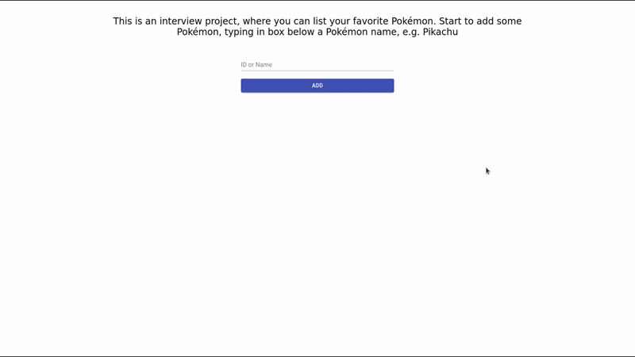
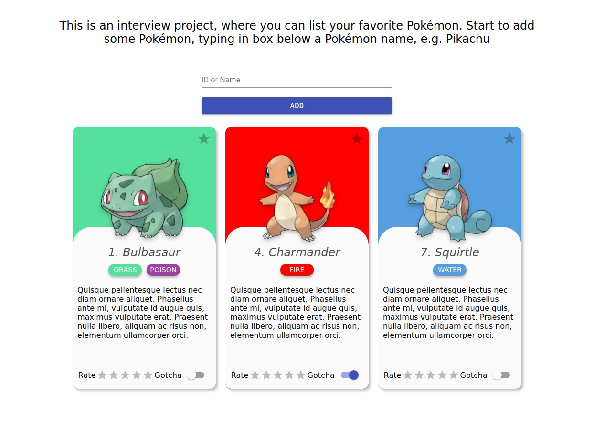

# App-Masters Interview

This is an interview project of [App Masters](https://appmasters.io/pt/)



## About

The project consist in create a app that list your favorite pokemons.

You can see pokemon type, rate and mark if are captured.

You can see a deploy [here]().

## Features

- [x] Add Pókemon
- [x] Favorite System
- [x] Rate System
- [ ] LocalStorage
- [ ] Orderby System
- [ ] Filter System

## 🚀 Getting Started

These instructions will allow you to obtain a copy of the project for development and testing purposes.

### 📋 Prerequisites

Nodejs 14+.

### 🔧 Install and Run

Clone the project

```sh
git clone app-masters
```

Install dependencies

```sh
cd app-masters

npm install
```

Run project

```sh
npm run dev
```

The application should be up and running at [http://localhost:3000](http://localhost:3000)

## 🛠️ Technologies

- [React](https://reactjs.org/)
- [Nextjs](https://nextjs.org/)
- [StyledComponents](https://styled-components.com/)
- [PokéAPI](https://pokeapi.co/)
- [Material UI](https://material-ui.com/)

## 🧑‍🎨 Autor

<a href="https://github.com/Ruy-Araujo">
 
 <p><strong>Ruy Araujo</strong></p>
</a>

[](https://www.linkedin.com/in/ruy-araujo)

## 📷 Screen Shots

#### Index Page



## 📄 License

This project is under MIT-license - see file [LICENSE.md](https://opensource.org/licenses/MIT) for details.
